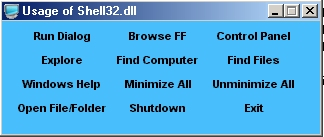



## Simple Windows Operations with Shell32\.dll

### Description

This code shows how to use the Shell32.dll in your project.
 
### More Info
 
Goto Project > References > Add 'Microsoft Shell Controls And Automation' to your project

             |
---                |---
**Submitted On**   |2002-09-15 13:24:04
**By**             |[AvEnGeR](https://github.com/Planet-Source-Code/PSCIndex/blob/master/ByAuthor/avenger.md)
**Level**          |Beginner
**User Rating**    |4.7 (14 globes from 3 users)
**Compatibility**  |VB 4\.0 \(16\-bit\), VB 4\.0 \(32\-bit\), VB 5\.0, VB 6\.0
**Category**       |[Miscellaneous](https://github.com/Planet-Source-Code/PSCIndex/blob/master/ByCategory/miscellaneous__1-1.md)
**World**          |[Visual Basic](https://github.com/Planet-Source-Code/PSCIndex/blob/master/ByWorld/visual-basic.md)
**Archive File**   |[Simple\_Win1314909152002\_dll\_u\.zip](https://github.com/Planet-Source-Code/avenger-simple-windows-operations-with-shell32-dll__1-39007/archive/master.zip)

### API Declarations

Private Sh32 as new Shell32.Shell

